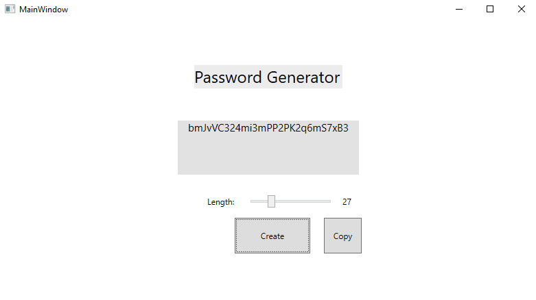

# Password_Generator

This application creates a password from random letters and numbers. The user can define the length of the password and after the generation it copies the password into your clipboard. It could be used to create safe passwords for accounts.
