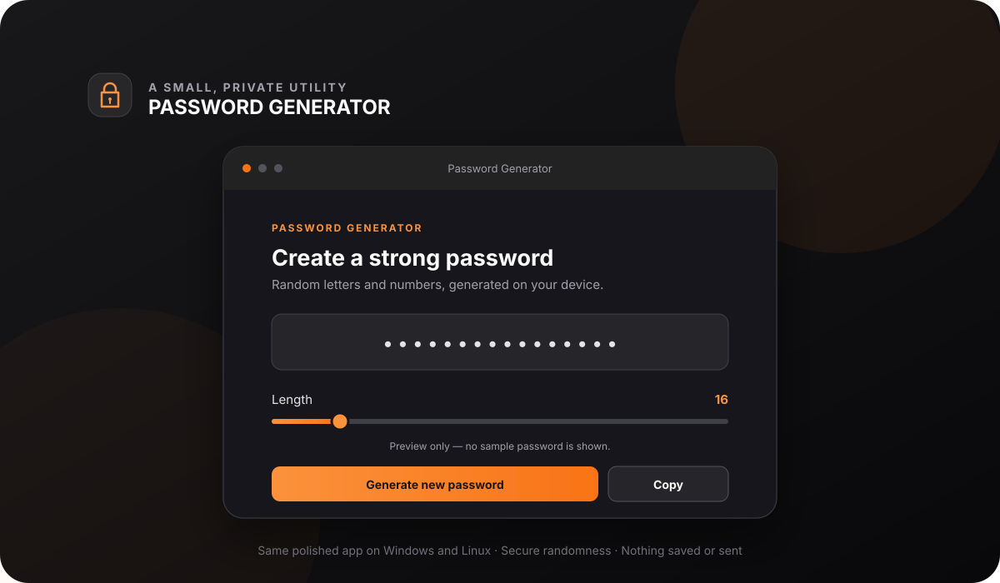

<div align="center">
  
  <h1>Password Generator</h1>
  <p>A small, private password generator for Windows and Linux.</p>
  <p>
    
    
    
  </p>
</div>

## A password in a few clicks

Choose a length and the character groups to include, generate a fresh password, and copy it when you’re ready. Passwords are created on your device with a cryptographically secure random generator. The app has no account, network service, or password history.

### Features

- **4–100 characters** from configurable uppercase letters, lowercase letters, digits, and symbols
- **Required character groups**: at least one character from each selected group
- **Avoid ambiguous characters** such as `0`, `O`, `l`, `1`, and `I`
- **Secure randomness** from .NET’s cryptographic random number generator
- **One-click copy** to your system clipboard
- **One shared app** with the same dark interface on Windows and Linux
- **No password storage or transmission**; copying happens only when you press **Copy**

## Run it

You’ll need the [.NET 10 SDK](https://dotnet.microsoft.com/download/dotnet/10.0).

### Linux (Omarchy / Arch)

```sh
omarchy pkg add dotnet-sdk
./scripts/install-linux.sh
```

The install script publishes a self-contained Linux x64 app and adds **Password Generator** to your application launcher.

### Windows

Run from the repository folder:

```powershell
dotnet run --project src/PasswordGenerator/PasswordGenerator.csproj
```

To publish a standalone Windows x64 build, run:

```powershell
./scripts/publish-windows.ps1
```

The executable is written to `artifacts/windows-x64/PasswordGenerator.exe`.

### Build from source

The Avalonia project is in [`src/PasswordGenerator`](src/PasswordGenerator). Open [`Password_Generator.sln`](Password_Generator.sln) in Visual Studio or build it with the .NET CLI:

```sh
dotnet build Password_Generator.sln
```

## Security notes

Password generation uses `RandomNumberGenerator.GetInt32`, not a general-purpose pseudo-random generator. The app doesn’t save passwords or send them anywhere. Once copied, the password is held by the operating system clipboard, where other local apps may be able to read it.

## Project history

The original WPF implementation is kept in [`legacy/windows-wpf`](legacy/windows-wpf) for reference. The maintained Windows and Linux app is the shared Avalonia project.

<p align="center"><sub>Made for a useful little utility that stays out of your way.</sub></p>
